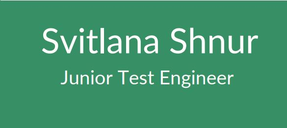

# **About me**
I'm a Junior QA Engineer, I finished the course and realized that I want to develop further in this business, because in this profession there are no limits to unleash your potential and continuous development. Testing is a very important business that allows you to produce a quality product that will satisfy both the customer and the user. My goal is to become a professional tester who ensures high quality products.

## **Socials**

 <a href="https://www.github.com/SvetaShnur" target="_blank" rel="noreferrer"> <picture> <source media="(prefers-color-scheme: dark)" srcset="https://raw.githubusercontent.com/danielcranney/readme-generator/main/public/icons/socials/github-dark.svg" /> <source media="(prefers-color-scheme: light)" srcset="https://raw.githubusercontent.com/danielcranney/readme-generator/main/public/icons/socials/github.svg" />  </picture> </a> <a href="http://www.instagram.com/svetochhek/profilecard/?igsh=MWw3ODdwZjljaDVuaA==" target="_blank" rel="noreferrer"> <picture> <source media="(prefers-color-scheme: dark)" srcset="https://raw.githubusercontent.com/danielcranney/readme-generator/main/public/icons/socials/instagram-dark.svg" /> <source media="(prefers-color-scheme: light)" srcset="https://raw.githubusercontent.com/danielcranney/readme-generator/main/public/icons/socials/instagram.svg" />  </picture> </a> <a href="https://www.linkedin.com/in/svetlana-shnur-a87598285" target="_blank" rel="noreferrer"> <picture> <source media="(prefers-color-scheme: dark)" srcset="https://raw.githubusercontent.com/danielcranney/readme-generator/main/public/icons/socials/linkedin-dark.svg" /> <source media="(prefers-color-scheme: light)" srcset="https://raw.githubusercontent.com/danielcranney/readme-generator/main/public/icons/socials/linkedin.svg" />  </picture> </a>

## **Skills**

* Basic testing theory (***types of testing***, ***test design techniques***)
* Understanding the role of a tester in a team (interaction with developers, analysts, managers)
* Classification of testing types (functional, regression, integration, system)
* Creation and optimization of test documentation
  * ***checklists*** 
  * ***test cases***
  * ***test suite*** 
  * ***bug reports***
* Hands-on experience with ***TestRail***, including creating and managing test suites
* Understanding of ***STLC***, ***SDLC***, ***QA*** processes and methodologies
* Understanding of agile methodologies (Scrum, Kanban) and participation in sprints/task boards
* User interface (UI) testing using ***Figma***, ***Perfect Pixel***, ***Photoshop***
* Testing with DevTools (***DOM analysis***, ***JavaScript errors***, ***network requests***)
* API testing (***Postman***, ***Swagger***)
* Database testing (queries to one and several tables)
* Analyzing databases and relationships between tables using ***dbdiagram.io***
* Basic understanding of ***HTML***, ***CSS***, ***SQL***, ***XML***, ***JSON***
* Version control with ***Git*** and ***GitHub***

## **Tools**

      

  
## **Education**

QA Manual courses at the international online university of modern professions GetEd
March 2023 - June 2023  
[**Certificate**](https://drive.google.com/drive/folders/1BjeZq-eiy8i_-Pk8-D5tBWOchdBF2lq3?usp=drive_link) of completion of courses

## **Portfolio**

* [**API**](https://github.com/SvetaShnur/Portfolio/tree/main/API)
* [**Databases**](https://github.com/SvetaShnur/Portfolio/tree/main/Databases)
* [**Example - XML and Json**](https://github.com/SvetaShnur/Portfolio/tree/main/Example%20-%20XML%20%D1%82%D0%B0%20JSON)
* [**Test desing techniques**](https://github.com/SvetaShnur/Portfolio/tree/main/Test%20design%20techniques)
* [**Example-Requirements-User Story-Acceptance Criteria**](https://github.com/SvetaShnur/Portfolio/blob/main/Example%20-%20Requirements%20-%20User%20Story%20-%20Acceptance%20Criteria.docx)

## **Resume**

* [**Resume in English**](https://github.com/SvetaShnur/Resume/blob/main/Resume%20Svitlana%20Shnur.pdf)
* [**Resume in Ukrainian**](https://github.com/SvetaShnur/Resume/blob/main/%D0%A0%D0%B5%D0%B7%D1%8E%D0%BC%D0%B5%20%D0%A1%D0%B2%D1%96%D1%82%D0%BB%D0%B0%D0%BD%D0%B0%20%D0%A8%D0%BD%D1%83%D1%80.pdf)